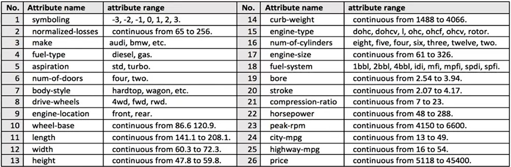
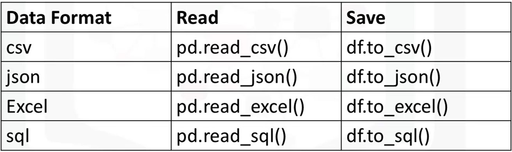

# Data Analysis

## Importing Datasets

### The problem

#### Why Data Analysis

- Dữ liệu ở khắp mọi nơi.
- Phân tích dữ liệu / khoa học dữ liệu giúp chúng ta trả lời các câu hỏi từ dữ liệu.
- Phân tích dữ liệu đóng một vai trò quan trọng trong:

  - Khám phá thông tin hữu ích
  - Trả lời câu hỏi
  - Dự đoán tương lai hoặc điều chưa biết

#### Tình huống: 

Tom muốn bán chiếc xe hơi của mình: Giả sử rằng chúng ta có một người bạn tên Tom. Và Tom muốn bán chiếc xe của mình. Nhưng vấn đề là anh ta không biết nên bán xe của mình giá bao nhiêu. Tom muốn bán chiếc xe của mình với giá cao nhất có thể. Nhưng anh cũng muốn đặt giá một cách hợp lý, để có ai đó sẽ muốn mua nó. Làm thế nào chúng ta có thể giúp Tom xác định giá tốt nhất cho chiếc xe của mình? Hãy nghĩ như các nhà khoa học dữ liệu và xác định rõ ràng một số vấn đề của anh ấy. Ví dụ, có dữ liệu về giá của những chiếc xe khác và đặc điểm của chúng không? Những đặc điểm nào của xe ảnh hưởng đến giá của chúng? Màu sắc? Thương hiệu? Liệu mã lực có ảnh hưởng đến giá bán , hoặc điều gì khác? Là một nhà phân tích dữ liệu hoặc nhà khoa học dữ liệu, đây là một số trong nhiều câu hỏi chúng ta có thể bắt đầu nghĩ đến. Để trả lời những câu hỏi này, chúng ta sẽ cần một số dữ liệu.

### Understanding the Data

#### Tập dữ liệu (CSV)

[Used Automobiles](Importing-Datasets/auto.csv)

#### Từng thuộc tính (label) trong tập dữ liệu



### Python Packages for Data Science

#### Scientific Computing Libraries in Python

1, Scientific Computing Libraries:

- Pandas (Data structures & tools)
- NumPy (Array & matrices)
- SciPy (Integrals, solving defferential equations, optimization)

2, Visualization Libraries

- Matplotlib (plots & graphs, most popular)
- Seaborn (plots: heat maps, time series, violin plots)

3, Algorithmic Libraries

- Scikit-learn (Machine Learning: regression, classification,... )
- Statsmodels (Explore data, estimate statistical models, and perform statistical tests.)

### Importing and Exporting Data in Python

#### Importing Data

- Quá trình tải và đọc dữ liệu vào Python từ các tài nguyên khác nhau.
- Hai tính chất quan trọng:

  - Format:  .csv, .json, .xlsx, .hdf ...
  - File Path of dataset

    - Computer: /Desktop/mydata.csv
    - Internet: https://...

#### Importing a CSV into Python

```Python
import pandas as pd

path = "Importing-Datasets/auto.csv"

df = pd.read_csv(path)
```

#### Importing a CSV without a header

```Python
import pandas as pd

path = "Importing-Datasets/auto.csv"

df = pd.read_csv(path, header = None)
```

#### Printing the dataframe in Python

- `df` in toàn bộ dataframe (không được khuyến nghị cho các tập dữ liệu lớn)
- `df.head(n)` hiển thị n hàng đầu tiên của dataframe
- `df.tail(n)` hiển thị n hàng cuối cùng của dataframe

#### Adding headers

- Replace default header (by `df.columns = headers`)

```Python
headers = ["symboling","normalized-losses","make","fuel-type","aspiration", "num-of-doors","body-style",
         "drive-wheels","engine-location","wheel-base", "length","width","height","curb-weight","engine-type",
         "num-of-cylinders", "engine-size","fuel-system","bore","stroke","compression-ratio","horsepower",
         "peak-rpm","city-mpg","highway-mpg","price"]

df.columns = headers

df.head(5)
```

#### Exporting a Pandas dataframe to CSV

- Duy trì tiến độ bất cứ lúc nào bằng cách lưu tập dữ liệu đã sửa đổi sau khi sử dụng.

```Python
path = "Importing-Datasets/ automobile.csv"
df.to_csv(path)
```

#### Exporting to diffirent formats in Python



### Getting Started Analyzing Data in Python

#### Những hiểu biết cơ bản từ dữ liệu

- Understand your data before you begin any analysis
- Should check:

  - Data types
  - Data Distribution

- Xác định các vấn đề tiềm ẩn với dữ liệu


